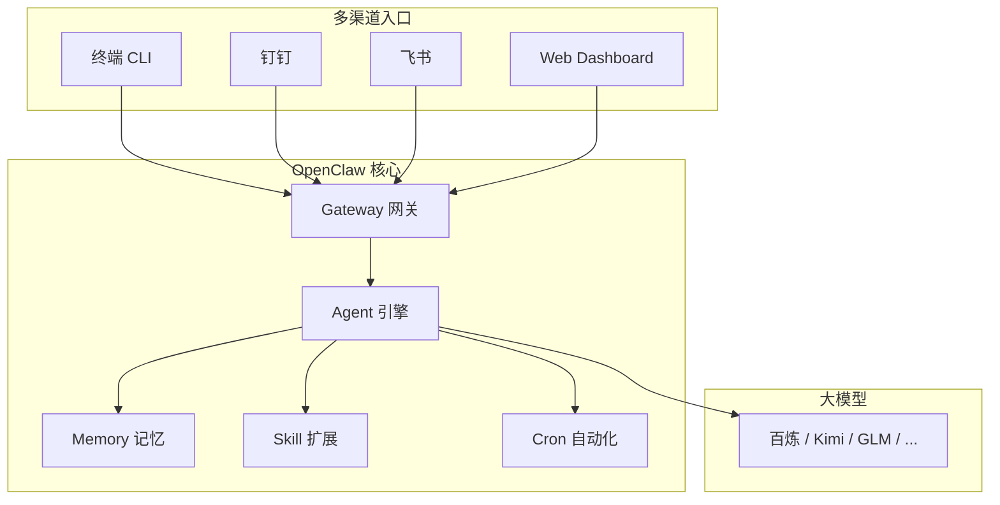

+++
date = '2026-03-15T10:00:00+08:00'
draft = false
title = 'OpenClaw 系列教程：总览'
tags = ['OpenClaw', 'AI', 'Agent']
+++

# OpenClaw 系列教程：总览

OpenClaw 是一个**本地优先的 Agentic AI 平台**——不只是聊天机器人，而是能记住上下文、调用工具、执行系统命令、定时干活的 **AI 智能体（Agent）**。

本篇是全系列的索引与导航，帮你快速了解 OpenClaw 的定位和阅读路径。

---

## 传统 Chatbot vs OpenClaw

| 维度 | 传统 Chatbot | OpenClaw (Agentic AI) |
|------|-------------|----------------------|
| 能力 | 只能对话 | 能对话 + 能行动 |
| 状态 | 无状态 | 具备持久记忆 |
| 模式 | 被动响应 | 可主动执行任务（cron / 事件驱动） |
| 部署 | 云端依赖 | 本地优先，数据不出境 |
| 扩展 | 固定功能 | Skill 扩展 + MCP 工具 + 多 Agent |

---

## 核心能力概览

| 能力模块 | 说明 |
|---------|------|
| 记忆系统（Memory） | 自动记住你的偏好、历史对话、关键信息，跨会话保持上下文 |
| 工具调用（Tool Use） | 可调用搜索、日历、数据库、API 等外部工具完成任务 |
| 终端控制（Shell） | 能直接执行终端命令，操作文件系统、运行脚本 |
| 多渠道支持 | 终端 CLI、钉钉、飞书、微信、Slack、Web 等多通道接入 |
| 多 Agent 协作 | 多个 Agent 各司其职，协同完成复杂工作流 |
| 隐私安全 | 本地部署、数据不出境、权限可控、审计日志完备 |
| Skill 扩展 | 通过 Skill 包扩展能力，社区共享，即装即用 |
| 自动化（Cron / Heartbeat） | 定时任务、事件驱动，无需人工触发即可主动执行 |

---

## 系统架构总览



---

> ⚠️ **安全警告**
>
> OpenClaw 拥有**系统级权限**！它可以：
> - 执行终端命令（包括 `rm -rf`、`sudo` 等危险操作）
> - 读写本地文件
> - 发起网络请求
>
> **安全守则（必须遵守）：**
> 1. **绝不在公网裸奔** —— 必须通过 VPN 或内网访问
> 2. **禁止 Root 运行** —— 使用普通用户权限启动
> 3. **启用认证** —— 开启 Token / OAuth 认证机制
> 4. **限制 IM 访问** —— 仅允许授权用户通过 IM 通道交互
> 5. **审计日志** —— 开启操作日志记录，定期审查
>
> 完整的安全纵深防御体系（五层防御模型）和配置模板详见 [10-规范与安全准则](./10-OpenClaw%20规范与安全准则.md)。

---

## 全系列文档目录

本系列按**使用 → 运维 → 开发**的渐进顺序编排。

### 使用篇（00-08）—— 使用人员读到这里即可

| 编号 | 文档标题 | 一句话说明 | ⏱ 时间 | 前置 | 难度 |
|------|---------|-----------|--------|------|------|
| 00 | [总览](./00-OpenClaw%20系列教程：总览.md) | 全系列索引与导航（本篇） | ~5分钟 | 无 | — |
| 01 | [入门指南：从零开始](./01-OpenClaw%20入门指南：从零开始.md) | 面向零基础同事，5 分钟上手体验 | ~15分钟 | 无 | 基础 |
| 02 | [安装与部署](./02-OpenClaw%20安装与部署.md) | 各平台安装方法、国内模型配置详解 | ~20分钟 | 01 | 基础 |
| 03 | [核心概念与配置](./03-OpenClaw%20核心概念与配置.md) | Agent 类型、Workspace、Bindings 路由、权限体系、局域网访问 | ~30分钟 | 02 | 进阶 |
| 04 | [通道配置（钉钉）](./04-OpenClaw%20通道配置（钉钉）.md) | 手把手接入钉钉，附其他通道简介 | ~40分钟 | 02, 03 | 基础 |
| 05 | [Memory：持久记忆系统](./05-OpenClaw%20Memory：让%20AI%20越用越聪明.md) | 两层记忆架构、Memory Discipline、EOD 自动补记 | ~25分钟 | 03 | 进阶 |
| 06 | [大模型配置与费用优化](./06-OpenClaw%20大模型配置与费用优化.md) | 国内模型对比、包月套餐、多 Agent 模型分配策略 | ~20分钟 | 02 | 基础 |
| 07 | [实战案例](./07-OpenClaw%20实战案例.md) | 行政助手、竞品采集、发票识别、Morning Brief | ~30分钟 | 01-06 | 基础 |
| 08 | [Skills：扩展 AI 的业务能力](./08-OpenClaw%20Skills：扩展%20AI%20的业务能力.md) | Skill 机制、安装方式、企业场景扩展；附 MCP 集成入门（进阶） | ~30分钟 | 03 | 基础~进阶 |

### 运维篇（09-10）—— 运维人员继续读

| 编号 | 文档标题 | 一句话说明 | ⏱ 时间 | 前置 | 难度 |
|------|---------|-----------|--------|------|------|
| 09 | [自动化：Cron 与 Heartbeat](./09-OpenClaw%20自动化：Cron%20与%20Heartbeat.md) | 定时任务、心跳巡检、Hooks 事件驱动 | ~20分钟 | 03 | 进阶 |
| 10 | [规范与安全准则](./10-OpenClaw%20规范与安全准则.md) | AGENTS.md 模板、五层安全防御、Denied Agent 配置 | ~30分钟 | 03, 09 | 进阶 |

### 开发篇（11-12）—— 运维/开发人员推荐阅读

| 编号 | 文档标题 | 一句话说明 | ⏱ 时间 | 前置 | 难度 |
|------|---------|-----------|--------|------|------|
| 11 | [Multi-Agent：多智能体协作](./11-OpenClaw%20Multi-Agent：多智能体协作.md) | 四种 Agent、五层隔离、典型协作模式 | ~40分钟 | 03, 10 | 高级 |
| 12 | [架构与原理（进阶）](./12-OpenClaw%20架构与原理（进阶）.md) | Gateway、Agent Loop、Session、Compaction 深度解析 | ~45分钟 | 11 | 高级 |

### 附录 —— 所有人推荐阅读

| 编号 | 文档标题 | 一句话说明 | ⏱ 时间 | 前置 | 难度 |
|------|---------|-----------|--------|------|------|
| 14 | [故障排查手册](./14-OpenClaw%20故障排查手册.md) | Gateway 启动、Agent 超时、钉钉消息、Memory、Skill、费用异常七类故障速查 | 按需查阅 | — | 基础 |

---

## 阅读指引

### 分层学习路径

```
快速上手（~1小时）
  01（入门概念）→ 02（安装）→ 04 前 3 节（接入钉钉）

深入使用（~3小时）
  + 03（核心配置）→ 05（Memory）→ 06（模型选择）→ 07（实战案例）→ 08（Skill）

运维进阶（+2小时）
  + 09（自动化）→ 10（安全规范）

开发进阶（+3小时）
  + 11（Multi-Agent）→ 12（架构原理）
```

### 按角色速查

| 你的角色 | 阅读范围 | 说明 |
|---------|---------|------|
| **使用人员** | 00-08 | 从入门到实战，学会日常使用 OpenClaw 和 Skill 扩展 |
| **运维人员** | 00-10 + 14 | 在使用篇基础上掌握自动化、安全规范和故障排查 |
| **开发人员** | 00-12 + 14 | 全部读完，深入多 Agent 架构和系统原理 |

---

## 术语表

| 术语 | 含义 | 首次详解 |
|------|------|---------|
| **Agent** | AI 智能体，具备记忆、工具调用和自主执行能力的 AI 实例 | 01 |
| **Gateway** | OpenClaw 核心网关进程，负责消息路由、认证和 Agent 调度 | 03, 12 |
| **Workspace** | Agent 的工作目录，存放行为规则（AGENTS.md）和记忆文件 | 03 |
| **Binding** | 消息路由规则，决定哪个渠道/用户的消息交给哪个 Agent 处理 | 03 |
| **Skill** | Markdown 描述的能力扩展包，零代码即可为 Agent 增加新能力 | 08 |
| **Plugin** | JS/TS 代码实现的能力扩展模块，适合需要编程的复杂集成 | 08, 12 |
| **Memory** | Agent 的持久化记忆系统，分 MEMORY.md（长期）和 memory/*.md（每日） | 05 |
| **Cron** | 定时自动执行任务的调度机制（如每天早上发早报） | 09 |
| **Heartbeat** | 固定间隔执行巡检的心跳机制（如每 5 分钟检查服务状态） | 09 |
| **MCP** | Model Context Protocol，标准化的 AI 工具接口协议 | 08 |
| **Compaction** | 对话历史压缩机制，防止上下文窗口溢出 | 12 |

---

## 延伸阅读

- [OpenClaw 官方文档](https://docs.openclaw.ai)
- [OpenClaw GitHub 仓库](https://github.com/openclaw/openclaw)
- [awesome-openclaw-usecases（社区用例集合）](https://github.com/hesamsheikh/awesome-openclaw-usecases)

---

| ← 上一篇 | 返回总览 | 下一篇 → |
|:---|:---:|---:|
| | | [01-入门指南：从零开始](./01-OpenClaw%20入门指南：从零开始.md) |
