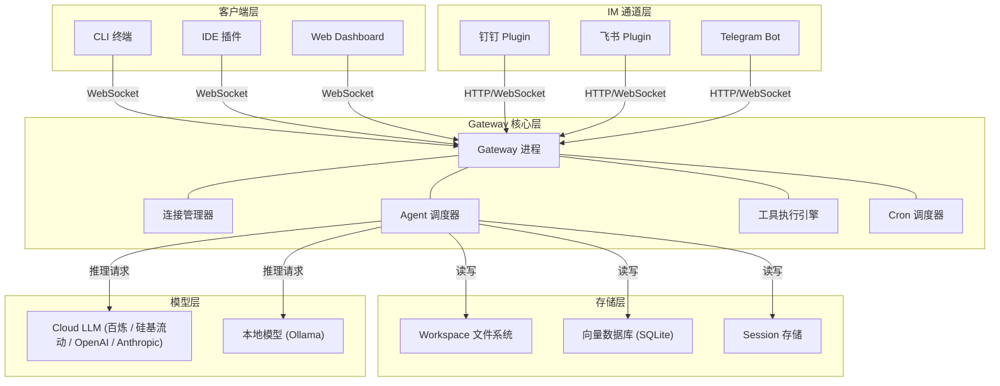
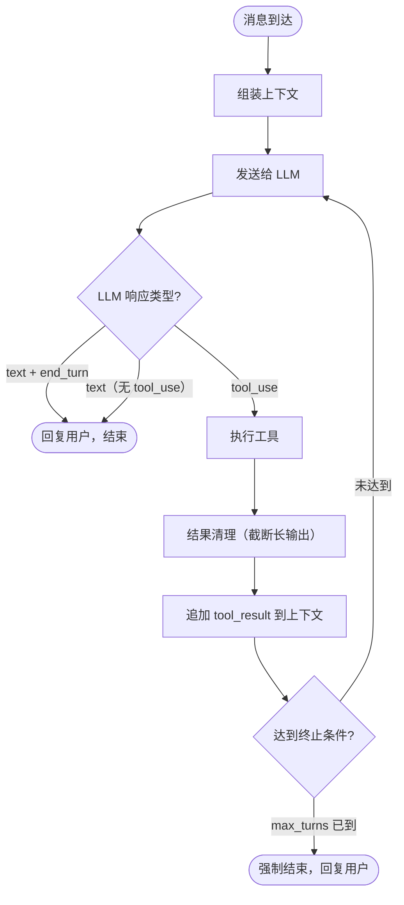
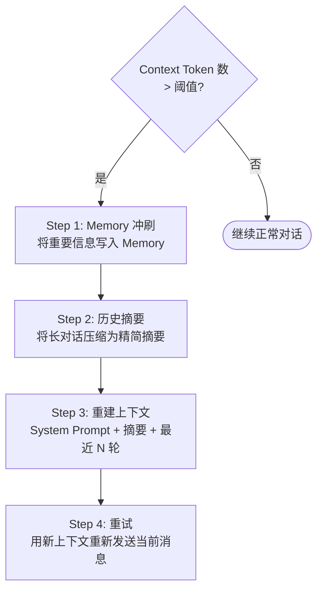

+++
date = '2026-03-15T00:12:00+08:00'
draft = false
title = 'OpenClaw 架构与原理（进阶）'
tags = ['OpenClaw', '架构', '进阶']
+++

## 本章导读

> **这篇文档回答以下问题：**
>
> 1. Gateway 内部事件流是怎样的？一条消息经历了哪些处理环节？
> 2. Agent Loop 从收到消息到回复的完整流程是什么？
> 3. Session 管理和 Compaction 机制如何保证对话可持续？
> 4. Memory、安全、扩展机制的架构本质是什么？
> 5. 遇到问题时如何通过日志和命令进行诊断？
>
> 如果你只是日常使用 OpenClaw，可以跳过本章。如果你负责部署、定制开发或排查疑难问题，强烈建议通读。

---

## 1. 系统全景架构

### 1.1 OpenClaw 是什么

OpenClaw 是一个**本地优先的 Agentic AI 平台**。与传统 SaaS 型 AI 不同，它的核心组件运行在你自己的机器上，数据不出境，同时提供完整的 Agent 调度、记忆管理和多通道接入能力。

### 1.2 总体架构分层

整个系统从上到下分为五层：

| 层级 | 名称 | 职责 | 代表组件 |
|------|------|------|---------|
| **L1** | 客户端层 | 用户交互入口 | CLI、IDE 插件、Web Dashboard |
| **L2** | IM 通道层 | 即时通讯平台适配 | 钉钉 Plugin、飞书 Plugin、Telegram Bot |
| **L3** | Gateway 核心层 | 连接管理、Agent 调度、工具执行 | OpenClaw Gateway（单一进程） |
| **L4** | 存储层 | 状态持久化 | Workspace 文件系统、SQLite 向量库、Session 存储 |
| **L5** | 模型层 | LLM 推理 | OpenAI / Anthropic / 硅基流动 / 本地 Ollama |

### 1.3 设计理念

| 设计理念 | 含义 | 好处 |
|---------|------|------|
| **Local-first** | 核心运行在本地，数据不上云 | 隐私可控、离线可用、延迟低 |
| **Single Gateway** | 单一网关进程统管一切 | 部署简单、资源占用小、调试方便 |
| **File-as-State** | 配置、记忆、会话均以文件形式存储 | 可 Git 版本管理、可直接编辑、无需数据库 |
| **Markdown-as-State** | 关键状态文件采用 Markdown 格式 | 人类可读、AI 原生理解、零学习成本 |
| **AGENTS.md 自然语言规则** | 用自然语言而非代码定义 Agent 行为 | 非技术人员也能定义 Agent 行为 |

### 1.4 架构总览图



---

## 2. Gateway 架构

Gateway 是 OpenClaw 的**心脏**——一个单一进程承担了所有核心职责。

### 2.1 六大职责

| 职责 | 说明 |
|------|------|
| **连接管理** | 维护所有 Client / Node / Channel 的 WebSocket 连接 |
| **Agent 调度** | 根据 Bindings 路由消息，创建/复用 Session，驱动 Agent Loop |
| **通道桥接** | 将 IM 平台的消息格式转换为内部统一协议 |
| **工具执行** | 接收 Agent 的 tool_use 请求，在受控环境中执行并返回结果 |
| **自动化调度** | 管理 Cron 定时任务和 Heartbeat 事件触发 |
| **存储管理** | 读写 Workspace 文件、Session 记录、向量索引 |

### 2.2 三类连接器

Gateway 通过三类连接器对外通信：

```
┌─────────────────────────────────────────────────┐
│                   Gateway                        │
│                                                  │
│  ┌──────────┐  ┌──────────┐  ┌──────────────┐   │
│  │  Client   │  │   Node   │  │   Channel    │   │
│  │ Connector │  │ Connector│  │  Connector   │   │
│  └─────┬────┘  └─────┬────┘  └──────┬───────┘   │
└────────┼─────────────┼──────────────┼────────────┘
         │             │              │
    WebSocket      内部通信      HTTP/WebSocket
         │             │              │
    CLI / IDE     Agent 运行      钉钉 / 飞书
    Web Dashboard   实例         Telegram 等
```

| 连接器 | 连接对象 | 协议 | 说明 |
|--------|---------|------|------|
| **Client Connector** | CLI / IDE / Web Dashboard | WebSocket | 面向终端用户的双向通信 |
| **Node Connector** | Agent 运行实例 | 内部通信 | Gateway 与 Agent Loop 之间的消息通道 |
| **Channel Connector** | IM 平台 | HTTP / WebSocket | 适配各 IM 平台的消息收发协议 |

### 2.3 WebSocket 协议与设备配对

CLI 和 IDE 等客户端通过 WebSocket 连接 Gateway。首次连接需要经过**设备配对**流程：

```
客户端                          Gateway
  │                                │
  │  1. openclaw pairing           │
  │  ────────────────────────────→ │
  │                                │ 生成配对码
  │  2. 返回配对码 + 配对 URL       │
  │  ←──────────────────────────── │
  │                                │
  │  3. 管理员在 Dashboard 点击     │
  │     "Approve" 批准配对         │
  │                                │
  │  4. 配对成功，建立持久连接       │
  │  ←━━━━━ WebSocket 双向通信 ━━━→│
```

配对成功后，客户端获得一个持久化 Token，后续连接无需重新配对。这个机制确保了只有授权设备能连接 Gateway。

### 2.4 Gateway 内部事件流

一条消息从进入 Gateway 到最终回复用户，经历以下事件流：

```
消息到达 Gateway
  │
  ├─ [1] 认证检查 (gateway.auth.token)
  │     └─ 失败 → 403 拒绝
  │
  ├─ [2] 通道解析 (Channel Connector 解码原始消息)
  │     └─ 提取: 发送者ID、通道类型、消息内容、附件
  │
  ├─ [3] 白名单检查 (allowFrom / dmPolicy / groupPolicy)
  │     └─ 不在白名单 → 消息丢弃
  │
  ├─ [4] Binding 路由匹配 (按 bindings 数组顺序逐条匹配)
  │     └─ 确定目标 agentId
  │
  ├─ [5] Session 解析 (根据 agentId + channelType + dmScope 生成 Session Key)
  │     ├─ 已有 Session → 复用
  │     └─ 新 Session → 创建
  │
  ├─ [6] Agent Loop 入队 (消息进入目标 Agent 的处理队列)
  │     ├─ 上下文组装 (Bootstrap Files + Memory + Skill + History)
  │     ├─ LLM 推理循环 (发送 → 响应 → 工具执行 → 追加结果 → 重新发送...)
  │     └─ 终止 (end_turn / max_turns / 纯文本回复)
  │
  ├─ [7] 响应回传 (通过对应的 Channel Connector 编码回复)
  │     └─ 转换为 IM 平台格式 (Markdown/Card/纯文本)
  │
  └─ [8] 后处理
        ├─ Session 持久化 (写入 messages.jsonl)
        ├─ Memory 写入 (如果触发条件满足)
        └─ 向量索引更新 (如果有新的 Memory 文件)
```

整个事件流是**同步阻塞**的（同一 Session 内），但不同 Session 的消息可以**并行处理**。

---

## 3. Agent Loop 流程

Agent Loop 是 OpenClaw 的**核心运行循环**——从收到用户消息到生成最终回复的完整流程。

### 3.1 入口与队列

消息进入 Agent Loop 有三种模式：

| 模式 | 触发方式 | 说明 |
|------|---------|------|
| **steer** | 新消息到达 | 标准入口——用户发送一条新消息，创建或进入一个 Session |
| **followup** | Agent 主动追加 | Agent 在已有 Session 中继续对话（如 Cron 触发） |
| **collect** | 收集子任务结果 | Main Agent 等待 Sub-Agent 完成后汇总结果 |

### 3.2 上下文组装

每次 Agent Loop 启动时，系统会**组装完整的上下文**发送给 LLM：

```
┌─────────────────────────────────────┐
│           最终发送给 LLM 的 Prompt     │
│                                      │
│  ┌────────────────────────────────┐  │
│  │  System Prompt                 │  │
│  │  ├─ AGENTS.md 行为规则          │  │
│  │  ├─ SOUL.md 人格定义            │  │
│  │  ├─ USER.md 用户信息            │  │
│  │  ├─ IDENTITY.md 身份声明        │  │
│  │  ├─ TOOLS.md 工具声明           │  │
│  │  └─ MEMORY.md 长期记忆          │  │
│  ├────────────────────────────────┤  │
│  │  Skill Snapshot（技能快照）      │  │
│  ├────────────────────────────────┤  │
│  │  Session History（对话历史）     │  │
│  ├────────────────────────────────┤  │
│  │  User Message（当前用户消息）    │  │
│  └────────────────────────────────┘  │
└─────────────────────────────────────┘
```

加载顺序如下：

1. **Bootstrap Files**：AGENTS.md → SOUL.md → USER.md → IDENTITY.md → TOOLS.md
2. **MEMORY.md**：长期记忆注入
3. **Skill Snapshot**：已加载 Skill 的内容或签名摘要
4. **Session History**：当前 Session 的历史消息
5. **当前用户消息**：本次触发 Agent Loop 的消息

### 3.3 Skill Token 优化设计

Skill 内容可能很长（几千甚至上万 Token）。OpenClaw 采用了一种**渐进加载**策略来节省 Token：

| 阶段 | 加载方式 | Token 消耗 |
|------|---------|-----------|
| **首次加载** | 完整注入 Skill 的全部内容 | 100%（完整内容） |
| **后续轮次** | 仅注入 Skill 的**签名摘要**（名称 + 能力描述 + 关键参数） | ~5-10%（节省 90%+） |
| **按需展开** | 当 Agent 需要使用某个 Skill 时，重新加载完整内容 | 按需恢复 |

> 💡 **为什么这样设计？** Agent 在大多数轮次中不需要 Skill 的完整内容，只需要"知道自己有哪些技能"即可。签名摘要足够让 Agent 判断是否需要调用某个 Skill，真正需要时再加载完整内容。

### 3.4 推理循环

上下文组装完成后，进入核心推理循环：



### 3.5 终止条件

Agent Loop 在以下任一条件满足时终止：

| 条件 | 说明 |
|------|------|
| **end_turn** | LLM 显式返回 `stop_reason: end_turn`，表示主动结束 |
| **max_turns** | 达到配置的最大轮次上限（防止无限循环） |
| **纯文本无 tool_use** | LLM 返回纯文本且不包含 tool_use 调用，视为最终回复 |

### 3.6 工具结果清理

工具执行后的输出可能非常长（如 `exec` 执行命令输出大量日志），直接塞入上下文会浪费 Token 甚至导致上下文溢出。OpenClaw 的处理策略：

- **短输出**（< 阈值）：完整保留
- **长输出**（> 阈值）：**保留头部 + 尾部**，中间截断并标记 `[...truncated N lines...]`

这种"头尾保留"策略保证了 Agent 能看到命令的起始信息（如版本号、路径）和结束状态（如 exit code、最终结果），同时避免中间的冗余输出浪费 Token。

---

## 4. Session 管理

### 4.1 Session Key 组成

每个 Session 由一个唯一的 **Session Key** 标识，组成如下：

```
Session Key = agentId + channelType + scope_identifier
```

| 组成部分 | 说明 | 示例 |
|---------|------|------|
| `agentId` | 处理该 Session 的 Agent ID | `main`、`dingtalk-agent` |
| `channelType` | 消息来源的通道类型 | `cli`、`dingtalk`、`telegram` |
| `scope_identifier` | 根据 DM Scope 模式决定的范围标识 | 见下文 |

### 4.2 DM Scope 三种模式

DM（Direct Message，私聊）场景下，`scope_identifier` 的生成方式取决于 `dmScope` 配置：

| 模式 | scope_identifier | 效果 | 风险 |
|------|-----------------|------|------|
| **main** | 固定值（所有私聊共享） | 所有用户的私聊共享同一个 Session | ⚠️ 用户 A 的对话内容可能泄露给用户 B |
| **per-peer** | 对方用户 ID | 每个用户独立一个 Session | ✅ 推荐，用户之间互相隔离 |
| **per-channel-peer** | 通道类型 + 对方用户 ID | 每个通道每个用户独立 Session | 最严格，同一用户在不同通道也隔离 |

> ⚠️ **安全建议**：生产环境**强烈推荐**使用 `per-peer` 或 `per-channel-peer` 模式。`main` 模式仅适合个人单用户场景，在多用户环境下存在信息泄露风险。

### 4.3 Session 生命周期

一个 Session 的生命周期如下：

```
创建 → 活跃（收发消息） → 超时/重置 → 归档/销毁
```

Session 重置（Reset）的触发条件：

| 触发方式 | 说明 |
|---------|------|
| **手动重置** | 用户发送 `/reset` 命令或在 Dashboard 中操作 |
| **超时重置** | Session 超过配置的空闲时间（如 30 分钟）后自动重置 |
| **Token 阈值** | Session 的上下文 Token 数超过阈值时触发 Compaction 或重置 |
| **Cron Mint 新 Session** | 定时任务触发时创建全新 Session，不复用旧的 |

### 4.4 Session 存储结构

Session 数据以文件形式持久化在各 Agent 的状态目录下（`~/.openclaw/agents/<agentId>/sessions/`）：

```
~/.openclaw/agents/
├── main/
│   └── sessions/
│       └── cli_default/
│           ├── messages.jsonl       # 消息记录（JSON Lines 格式）
│           ├── metadata.json        # Session 元数据（创建时间、轮次数等）
│           └── compaction.json      # Compaction 状态
├── dingtalk-agent/
│   └── sessions/
│       └── dingtalk_user123/
│           ├── messages.jsonl
│           ├── metadata.json
│           └── compaction.json
└── ...
```

---

## 5. Context 窗口与 Compaction

### 5.1 Context 窗口 ≠ Memory

这两个概念经常被混淆，必须区分清楚：

| 维度 | Context 窗口 | Memory |
|------|-------------|--------|
| **本质** | 单次 LLM 调用的输入 | 跨会话的持久化存储 |
| **生命周期** | 一次 Session 内 | 永久（直到手动删除） |
| **大小限制** | 受模型 Context Length 约束（如 200K Token） | 受文件系统空间约束 |
| **类比** | 工作台上摊开的资料 | 档案柜里的文件夹 |

### 5.2 Context 窗口组成

一次 LLM 调用的 Context 窗口由以下部分组成：

| 组成部分 | 来源 | 占比（典型值） |
|---------|------|-------------|
| System Prompt | Bootstrap Files + MEMORY.md | 10-20% |
| Skill Snapshot | 已加载的 Skill 内容/签名 | 5-15% |
| Session History | 本次 Session 的历史消息 | 50-70% |
| 当前消息 | 用户当前输入 | 5-10% |
| 工具结果 | tool_use 执行后的返回值 | 可变 |

### 5.3 Prompt Modes

OpenClaw 支持三种 Prompt 加载模式，用于在**信息完整性和 Token 节省**之间取舍：

| 模式 | 加载内容 | Token 消耗 | 适用场景 |
|------|---------|-----------|---------|
| **full** | 完整加载所有 Bootstrap Files + Skill | 最高 | 首次对话、需要完整上下文 |
| **minimal** | 仅加载 AGENTS.md + MEMORY.md，Skill 只加载签名 | 中等 | 多轮对话的后续轮次 |
| **none** | 仅加载 AGENTS.md 核心规则 | 最低 | 简单跟进、上下文已足够 |

### 5.4 Compaction 机制

当 Session History 增长到接近模型 Context Length 上限时，OpenClaw 会触发 **Compaction**（压缩）——一个四步流程：



四步详解：

| 步骤 | 动作 | 目的 |
|------|------|------|
| **Step 1: Memory 冲刷** | 将 Session 中的重要信息提取并写入 MEMORY.md 或 memory/*.md | 防止信息丢失 |
| **Step 2: 历史摘要** | 让 LLM 将长对话历史压缩为一段精简摘要 | 保留关键上下文，减少 Token |
| **Step 3: 重建上下文** | 用 System Prompt + 摘要 + 最近 N 轮消息重新组装上下文 | 缩减 Context 大小 |
| **Step 4: 重试** | 用新的（更短的）上下文重新发送当前消息给 LLM | 确保对话可以继续 |

> 💡 **类比**：Compaction 就像整理书桌——桌面快堆满了，先把重要文件归档到柜子里（Memory 冲刷），把散乱的笔记整理成一页摘要（历史摘要），清空桌面重新摆放（重建上下文），然后继续工作（重试）。

---

## 6. Memory 系统架构

> 完整的 Memory 概念、使用方法和最佳实践请参见 [05-Memory：让 AI 越用越聪明](./05-OpenClaw%20Memory：让%20AI%20越用越聪明.md)。本节聚焦架构视角。

Memory 系统采用**两层架构**：长期记忆（`MEMORY.md`，自动注入 System Prompt）和每日记忆（`memory/*.md`，通过向量搜索按需检索）。两层分工明确——长期记忆存储策展级关键信息，每日记忆存储日常详细记录。

### 6.1 Memory 与 Compaction 的交互时序

Memory 写入并非独立过程，它与 Compaction 机制深度耦合：

```
正常对话 ──→ Context 接近上限 ──→ 触发 Compaction
                                      │
                                      ├─ Step 1: Memory 冲刷（提取重要信息写入 MEMORY.md）
                                      ├─ Step 2: 历史摘要（压缩对话）
                                      ├─ Step 3: 重建上下文
                                      └─ Step 4: 重试（用新上下文继续）
```

关键设计：Compaction 的 Step 1（Memory 冲刷）**先于**历史摘要执行，确保在压缩对话之前已将重要信息持久化，避免信息丢失。

### 6.2 向量索引构建流程

每日记忆文件写入后，系统会自动触发向量索引构建：

1. **文本分块**：将 Markdown 内容按段落/标题分割为语义块
2. **向量化**：调用 Embedding 模型（默认使用当前配置的 LLM Provider 的 Embedding 端点）将每个块转为向量
3. **存入索引**：写入 SQLite 向量数据库（sqlite-vss），建立文件路径 → 向量的映射
4. **检索时**：`memory_search` 将查询文本向量化，在索引中做近似最近邻搜索，返回 Top-K 相关块

---

## 7. 安全架构

> 完整的安全配置模板、Denied Agent 配置、AGENTS.md 安全规则等请参见 [10-规范与安全准则](./10-OpenClaw%20规范与安全准则.md)。本节聚焦架构原理。

OpenClaw 的安全体系采用**五层纵深防御**（Defense in Depth）：网络层（Gateway Token）→ 通道层（IM 白名单）→ Agent 层（工具权限）→ 运行时层（Sandbox 隔离）→ 提示层（AGENTS.md 规则）。前四层为代码强制的**硬约束**，第五层为依赖模型行为的**软约束**。

### 7.1 Sandbox 容器化实现原理

Sandbox 是第四层安全防御的核心实现。其底层依赖 Docker：

1. **容器创建**：Gateway 在需要执行命令或浏览器操作时，通过 Docker API 创建一个受限容器
2. **文件系统挂载**：根据 `workspaceAccess`（`none`/`ro`/`rw`）和 `binds` 配置，将宿主路径挂载到容器内
3. **命令执行**：通过 `docker exec` 在容器内执行 Agent 的 `exec` 工具请求
4. **结果回传**：捕获 stdout/stderr 和 exit code，回传给 Agent Loop
5. **容器生命周期**：由 `sandbox.scope` 决定——`session` 模式每个 Session 创建/销毁容器，`agent` 模式复用同一 Agent 的容器

```
Gateway
  │
  ├─ exec 请求到达
  │     │
  │     ├─ sandbox.mode 检查 ──→ 不在沙箱范围 ──→ 宿主机直接执行
  │     │
  │     └─ 在沙箱范围内
  │           │
  │           ├─ 查找/创建容器（按 scope 策略）
  │           ├─ 挂载 workspace（按 workspaceAccess）
  │           ├─ 挂载额外路径（按 binds）
  │           ├─ docker exec 执行命令
  │           └─ 回传结果给 Agent Loop
  │
  └─ browser 请求到达
        │
        ├─ 创建隔离的 Chromium 实例
        ├─ 通过 CDP（Chrome DevTools Protocol）控制
        ├─ browser.binds 控制可见路径
        └─ allowHostControl 决定是否允许控制宿主浏览器
```

### 7.2 Browser 隔离的 CDP 协议细节

浏览器操作通过 CDP（Chrome DevTools Protocol）实现远程控制：

| 组件 | 说明 |
|------|------|
| **Chromium 实例** | 每个 Browser Sandbox 运行一个独立的 Chromium 进程（headless 模式） |
| **CDP 端口** | 每个实例分配独立的 CDP 调试端口，由 `browser.profiles` 中的 `cdpPort` 配置 |
| **Session 隔离** | 不同 Agent 的浏览器实例使用独立的用户数据目录，Cookie/缓存/登录态完全隔离 |
| **路径隔离** | `sandbox.browser.binds` 控制容器内可见的下载路径、数据路径 |

> ⚠️ **关键设计**：`sandbox.browser.binds` 已设置（包括空数组 `[]`）时使用该字段；未设置时**回退到** `sandbox.docker.binds`。因此 `"binds": []` 和不设置 binds 的效果**完全不同**。

---

## 8. 扩展机制架构

> Skill 的使用方法和最佳实践请参见 [08-Skills：扩展 AI 的业务能力](./08-OpenClaw%20Skills：扩展%20AI%20的业务能力.md)。本节聚焦两种扩展机制的技术本质。

Skill 和 Plugin 本质上运行在系统的**不同层**：

| 维度 | Skill | Plugin |
|------|-------|--------|
| **运行层** | Prompt 层（注入 System Prompt） | Runtime 层（Hook 进 Gateway 进程） |
| **执行方式** | LLM 理解后自主执行 | Node.js 代码直接执行 |
| **安全影响** | 低（不执行代码） | 高（Gateway 进程内执行） |

### 8.1 Plugin SDK 生命周期

Plugin 作为 NPM 包被 Gateway 加载后，按以下生命周期 Hook 参与系统运行：

```
Gateway 启动
  │
  ├─ onLoad()          ← Plugin 被加载，初始化资源、注册事件监听
  │
  ├─ onGatewayReady()  ← Gateway 就绪，可以开始接收连接
  │
  ├─ [运行阶段]
  │   ├─ onMessage(msg)       ← 收到通道消息时调用
  │   ├─ onBeforeToolCall()   ← 工具调用前（可拦截/审核）
  │   ├─ onAfterToolCall()    ← 工具调用后（可记录/审计）
  │   └─ onSessionStart()     ← 新会话创建时
  │
  └─ onUnload()        ← Plugin 卸载，清理资源
```

### 8.2 Channel Connector 适配接口

Channel Plugin（如钉钉、飞书、Telegram）需要实现的核心接口：

| 接口 | 职责 |
|------|------|
| `connect()` | 建立与 IM 平台的连接（WebSocket/HTTP 长连接） |
| `onMessage(rawMsg)` | 接收 IM 平台的原始消息，转换为 OpenClaw 内部格式 |
| `sendMessage(msg)` | 将 Agent 的回复转换为 IM 平台格式并发送 |
| `disconnect()` | 断开连接，清理资源 |

每个 Channel Connector 在 Gateway 进程内运行，负责**协议转换**——将各 IM 平台的私有协议映射到 OpenClaw 的统一消息格式。

---

## 9. 关键设计决策总结

| 设计点 | 选择 | 理由 |
|--------|------|------|
| 部署模型 | Local-first（本地优先） | 数据隐私、离线可用、零云端依赖 |
| 网关架构 | Single Gateway（单一网关） | 部署简单、调试方便、资源占用小 |
| 状态存储 | File-as-State（文件即状态） | 可 Git 管理、无需数据库、可直接编辑 |
| 行为定义 | AGENTS.md 自然语言 | 非技术人员可参与、LLM 原生理解 |
| Session 隔离 | per-peer DM Scope | 多用户安全隔离、防止信息泄露 |
| Skill 加载 | 签名摘要 + 按需展开 | 节省 90%+ Token，不影响能力发现 |
| Context 溢出 | Compaction 四步法 | 信息不丢失、对话可无限延续 |
| 安全模型 | 五层纵深防御 | 任何一层被突破都有下一层兜底 |
| 扩展机制 | Skill + Plugin 双轨 | 低门槛声明式 + 高能力命令式并存 |
| 工具结果 | 头尾保留截断 | 保留关键信息、节省 Token |

---

## 10. 运维与调试

### 10.1 Gateway 日志

Gateway 运行时产生的日志是排查问题的第一手资料。

**日志位置**：默认输出到 stdout/stderr，可通过重定向保存：

```bash
openclaw gateway start 2>&1 | tee ~/.openclaw/gateway.log
```

**日志级别**：

| 级别 | 说明 | 适用场景 |
|------|------|---------|
| `error` | 错误信息 | 生产环境默认 |
| `warn` | 警告信息 | 包含降级、回退等非致命问题 |
| `info` | 常规信息 | 连接建立/断开、Session 创建/销毁 |
| `debug` | 调试信息 | 完整的消息流转、工具调用详情 |

设置日志级别：

```bash
openclaw gateway start --log-level debug
```

### 10.2 常用诊断命令

| 命令 | 用途 |
|------|------|
| `openclaw status` | 查看 Gateway 运行状态、已连接的客户端/通道 |
| `openclaw sessions list` | 列出所有活跃 Session |
| `openclaw sessions inspect <session-id>` | 查看 Session 详情（消息数、Token 用量、模型） |
| `openclaw agents list` | 列出所有已配置的 Agent |
| `openclaw config validate` | 验证 `openclaw.json` 配置文件语法和逻辑 |
| `openclaw plugins list` | 查看已安装 Plugin 及状态 |

### 10.3 常见问题诊断

**Agent 不响应消息**：
1. `openclaw status` 确认 Gateway 正在运行
2. 检查日志中是否有 `binding not matched` 或 `auth failed` 错误
3. `openclaw config validate` 检查配置是否有效
4. 确认对应通道 Plugin 已安装且状态正常

**Token 消耗异常偏高**：
1. `openclaw sessions inspect` 检查 Session 的 Token 用量
2. 查看是否有 Skill 被反复完整加载（应为签名摘要模式）
3. 检查 Heartbeat 频率是否过高
4. 查看 Compaction 是否正常触发（Context 是否无限增长）

**Compaction 未触发**：
1. 检查模型的 `contextWindow` 配置是否正确
2. 查看日志中是否有 `compaction skipped` 或 `compaction failed` 信息
3. 确认 Session 的消息量是否真的接近 Context 上限

### 10.4 性能调优参数

| 参数 | 默认值 | 说明 |
|------|--------|------|
| `agents.defaults.maxTurns` | 无限制 | Agent Loop 最大轮次，防止无限循环，建议设置为 20-50 |
| `agents.defaults.contextWindow` | 跟随模型 | 可覆盖模型的 Context 窗口大小，用于提前触发 Compaction |
| `heartbeat.every` | - | 心跳间隔，过短会导致高 Token 消耗 |
| `sandbox.scope` | `session` | 容器作用域，`agent` 模式可减少容器创建开销 |

---

## 11. 延伸阅读

- [03-核心概念与配置](./03-OpenClaw%20核心概念与配置.md) — 回顾基础概念和配置体系
- [05-Memory：让 AI 越用越聪明](./05-OpenClaw%20Memory：让%20AI%20越用越聪明.md) — Memory 的使用与最佳实践
- [11-Multi-Agent](./11-OpenClaw%20Multi-Agent：多智能体协作.md) — 多 Agent 协作架构
- [10-规范与安全准则](./10-OpenClaw%20规范与安全准则.md) — 操作规范和安全硬规则
- [06-大模型配置与费用优化](./06-OpenClaw%20大模型配置与费用优化.md) — Token 节省和模型选择
- [00-总览](./00-OpenClaw%20系列教程：总览.md) — 全系列索引与导航
- [OpenClaw 官方架构文档](https://docs.openclaw.ai/architecture)
- [OpenClaw GitHub 源码](https://github.com/openclaw/openclaw)
- 有问题？联系内部 AI 基础设施团队或在钉钉群内提问

---

| ← 上一篇 | 返回总览 | 下一篇 → |
|:---|:---:|---:|
| [11-Multi-Agent：多智能体协作](./11-OpenClaw%20Multi-Agent：多智能体协作.md) | [00-总览](./00-OpenClaw%20系列教程：总览.md) | |
